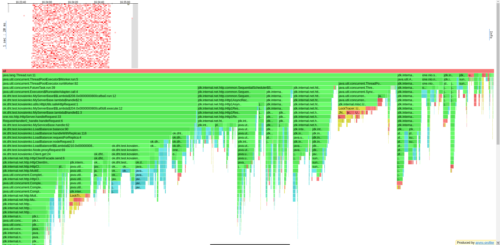
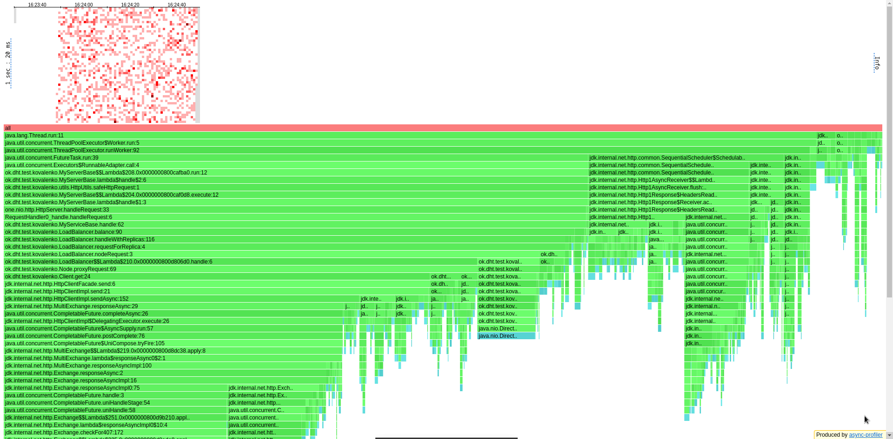
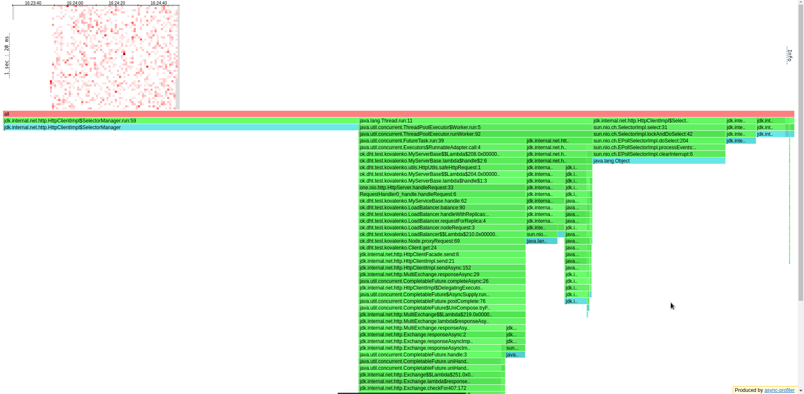
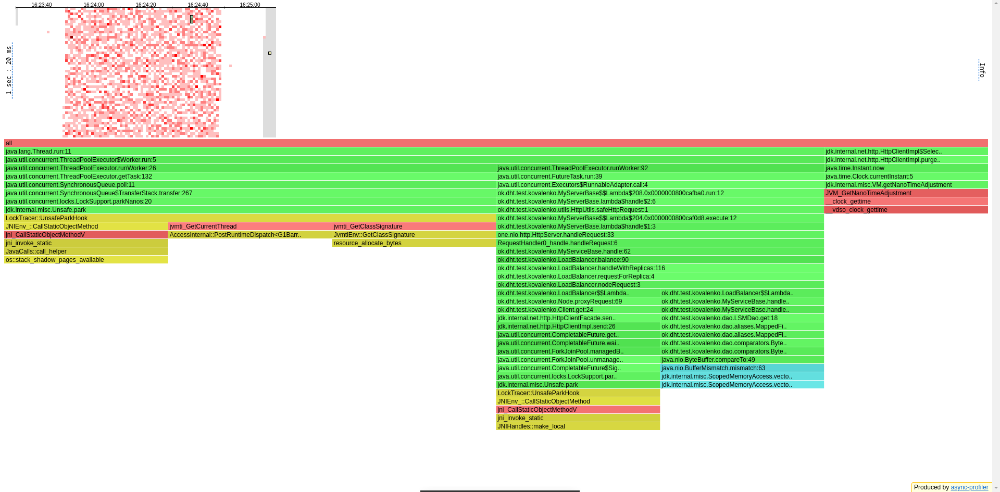
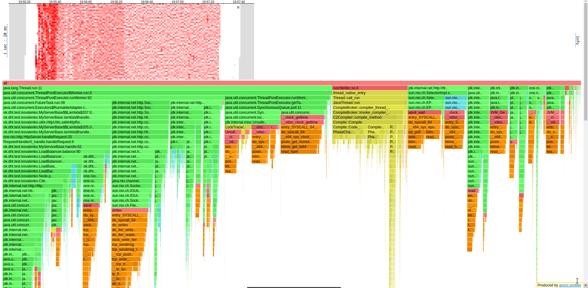
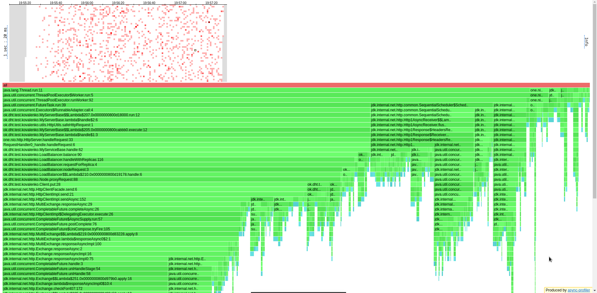
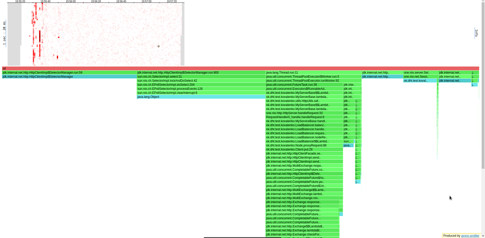

# Отчёт по профилированию NoSQL-базы данных (Репликация)

## Общая часть

3 шарда с предыдущего стейджа были перезаполнены данными так, чтобы они
хранились равномерно (1:1:1). С этого этапа тестироваться в wrk будут случайные
существующие ключи у GET (поскольку это самая тяжёлая операция) и вставка ключей
фиксированной длины (поскольку вставка ключей случайной длины раз от раза
находится на одном и том же уровне - 150rps).

## GET

### Бьём по случайному ключу

Начинаем со 100Krps (заведомо большое число, приводящее систему к перегрузке):

```
../wrk2/wrk -c64 -d60s -t4 -R100000 http://localhost:19234 -s ../scripts/get/get-existing-random.lua
Running 1m test @ http://localhost:19234
  4 threads and 64 connections
  Thread calibration: mean lat.: 4317.370ms, rate sampling interval: 16031ms
  Thread calibration: mean lat.: 4317.857ms, rate sampling interval: 16031ms
  Thread calibration: mean lat.: 4316.935ms, rate sampling interval: 16031ms
  Thread calibration: mean lat.: 4013.089ms, rate sampling interval: 14434ms
  Thread Stats   Avg      Stdev     Max   +/- Stdev
    Latency    36.50s    13.24s    0.98m    60.22%
    Req/Sec   418.17     71.88   482.00     66.67%
  100442 requests in 1.00m, 8.71MB read
Requests/sec:   1673.63
Transfer/sec:    148.55KB
```

Проверим 1.5Krps:

```
../wrk2/wrk -c64 -d60s -t4 -R1500 -L http://localhost:19234 -s ../scripts/get/get-existing-random.lua
Running 1m test @ http://localhost:19234
  4 threads and 64 connections
  Thread calibration: mean lat.: 2.204ms, rate sampling interval: 10ms
  Thread calibration: mean lat.: 2.120ms, rate sampling interval: 10ms
  Thread calibration: mean lat.: 2.174ms, rate sampling interval: 10ms
  Thread calibration: mean lat.: 2.154ms, rate sampling interval: 10ms
  Thread Stats   Avg      Stdev     Max   +/- Stdev
    Latency     3.21ms    8.19ms  92.67ms   97.28%
    Req/Sec   395.27     75.89   777.00     67.85%
  89973 requests in 1.00m, 7.80MB read
Requests/sec:   1499.58
Transfer/sec:    133.10KB
```

База смогла втащить лишь 1.5Krps, что **в 4 раза хуже**, чем было на предыдущем
этапе. Посмотрим на профили.

По CPU

видим, что 40% времени уходит на взаимодействие с репликами (из них мы 4% "паркуемся"),
20% на задачи SequentialScheduler (14% на Http1AsyncReceiver::flush, который очищает очередь
запросов, и 6% на TryEndDeferredCompleter::complete, отвечающий за выгрузку данных 
в функции runOrSchedule), 8% на слушателей записи в сокеты (то есть бесполезно расходуется
время), 8% на "паркинг", 8% на триггеринг запроса (ивента), остальное по мелочи уходит
на другие Http задачи. Хотелось бы побольше времени на наши задачи, но сейчас из-за
последовательного опроса реплик http сжирает заметно времени на себя. Итого 20% времени
мы тратим в никуда. Предполагается, что асинхронный клиент решит эту проблему,
вернув показатели к тем, что были на шардировании. 

По ALLOC

видим, 66.5% аллокаций - наши (3% при преобразовании java.net.HttpResponse в one.nio.Response,
7% на аллокации dao::get, 5% в client::get, 8% на получение асинхронного ответа,
39% на завершение запроса), 22.5% на SchedulableTasks, описанные выше
(18.5% на Http1AsyncReceiver::flush и 4% на TryEndDeferredCompleter::complete), 
оставшаяся часть аллокаций приходится на SelectorManager. По аллокациям результаты 
хотя неплохие, но взаимодействие по сети забирает заметное (33.5%) количество ресурсов.
Рассматривая отдельные фреймы профиля, становится заметным, что под капотом client::send
использует client::sendAsync и, видимо, у CompletableFuture вызывает метод get. Теперь
убеждаемся в том, что асинхронный клиент на CF решит проблему падения производительности.

По LOCK

видим, что в целом локов немного, селекты блокируют нас 52% времени, 21% мы блокируемся
в client::get (ожидаемо), 8% - на Http1AsyncReceiver::flush, 17% блокировок создаёт
цикл epoll, в котором мы ждём освобождения файловых дескрипторов. Кажется, что КПД
нашего сервера очень низкий, поскольку, судя по локам на селектах, он мог бы втащить больше,
чем 1.5Krps, но из-за долгой обработки внутри каждого запроса мы не можем принимать другие
запросы. Нужен асинхронный клиент.

По латенси

видим, что на 97 перцентиле заметно резкое (в 15 раз) повышение времени отклика. Внимательно
исследуя фреймы хитмапы, находим место, где в течение 60ms (3 фрейма) наблюдаются
сисколы для "парковки" потоков, что примерно укладывается в то, что максимальное
латенси доходило до 92ms. Если поискать ещё, то таких мест окажется больше.


## PUT

На put'ах опытным путём было установлено, что из-за долгого "разогрева" базы
лучше wrk'ашить 2 минуты, а не одну, как было раньше.

### Фиксированной длины

Начинаем со 100Krps:

```
../wrk2/wrk -c64 -d120s -t4 -R100000 http://localhost:19234 -s ../scripts/put/put-fixed.lua
Running 2m test @ http://localhost:19234
  4 threads and 64 connections
  Thread calibration: mean lat.: 6460.481ms, rate sampling interval: 18808ms
  Thread calibration: mean lat.: 6466.266ms, rate sampling interval: 18841ms
  Thread calibration: mean lat.: 6461.100ms, rate sampling interval: 18841ms
  Thread calibration: mean lat.: 5529.233ms, rate sampling interval: 16875ms
  Thread Stats   Avg      Stdev     Max   +/- Stdev
    Latency     1.07m    30.72s    1.96m    57.83%
    Req/Sec   580.67     12.54   592.00     80.95%
  262338 requests in 2.00m, 19.01MB read
Requests/sec:   2186.18
Transfer/sec:    162.26KB
```

Опытным путём подбираем rps, которое втащит наша база до точки разладки - 1.5Krps:

```
../wrk2/wrk -c64 -d120s -t4 -R1500 -L http://localhost:19234 -s ../scripts/put/put-fixed.lua
Running 2m test @ http://localhost:19234
  4 threads and 64 connections
  Thread calibration: mean lat.: 4993.429ms, rate sampling interval: 13213ms
  Thread calibration: mean lat.: 4995.218ms, rate sampling interval: 13197ms
  Thread calibration: mean lat.: 4072.369ms, rate sampling interval: 11288ms
  Thread calibration: mean lat.: 5000.591ms, rate sampling interval: 13205ms
  Thread Stats   Avg      Stdev     Max   +/- Stdev
    Latency     2.34s     2.98s    8.38s    73.89%
    Req/Sec   398.76     39.16   487.00     63.64%
  179607 requests in 2.00m, 13.02MB read
Requests/sec:   1496.68
Transfer/sec:    111.08KB
```

По времени отклика не очень похоже, что мы справляемся с нагрузкой, и тем не менее
wrk утверждает, что мы втащили нагрузку. Перформанс системы, как и в случае с гетами,
**упал в 4 раза**, что находится в пределах разумного трейдофа скорости на гарантии безопасности.

По CPU

видим, что на старте очень жирный кусок фреймов занимает компиляция (из 14 секунд
почти 60% времени) - разогрев базы, местами появляется GC, но его "stop the world" -
ничего в сравнении с работой джита. Этим объясняется то, что наше латенси на старте
измеряется не в миллисекундах, а в секундах. В целом видим, что на работу с репликами
уходит всего лишь 19% процессорного времени, 10% времени на сокетах крутятся подписчики
и ждут записи в них (то есть время тратится бесполезно), 9% времени уходит на
Http1AsyncReceiver::flush, 10% времени потоки "отдыхают", 7% мы трансферим запросы из
TransferStack, 13% времени компилируемся (в целом компиляцию стоит брать в расчёт
только на старте), всё оставшееся время (30%) занимают селекты (из которых мы 6% крутимся
в epoll_wait, то есть если бы мы быстрее отдавали ответы, то дескрипторы становились бы,
соответственно, быстрее свободными, и мы бы меньше уже крутились в еполе).

По ALLOC

ситуация в общем та же, что и на гетах.

По LOCK

ситуация в общем та же, что и на гетах.

По латенси

видим, что 50% запросов не умещается в 5мс. На старте (12.5% времени) это может
быть связано с компиляцией потоков, а в целом с тем, что мыпостоянно (29% времени)
дёргаем системные часы (syscall __clock_gettime).

## Выводы

Заключаем, что трейдоф в репликации получился сравнительно адекватным,
за распределение копий данных мы пожертвовали перформансом в 4 раза.
